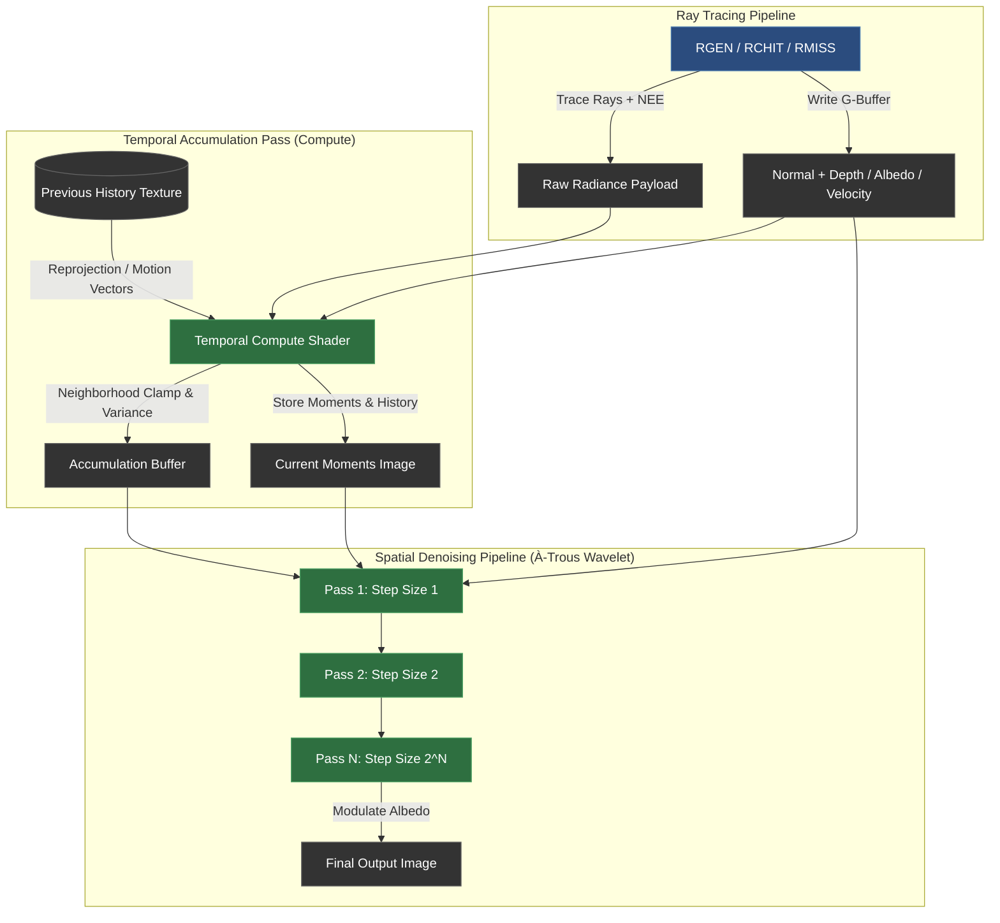

# Real-Time Vulkan Path Tracer & Wavelet Denoiser

A real-time hardware-accelerated Vulkan path tracer featuring a temporal-spatial À-Trous wavelet denoiser, dynamic resolution scaling, and real-time performance diagnostics using Dear ImGui.

## Showcase
https://github.com/user-attachments/assets/1e1ddac3-6e07-43cd-b2f0-fa592b3c74f9

## Architecture & Pipeline Overview
The pipeline combines ray tracing dispatches with multi-pass compute filtering to achieve real-time, noise-free frame delivery at 1 SPP.

## Performance Benchmarks
*Benchmarked on [NVIDIA GeForce RTX 4070 Laptop GPU / Intel(R) UHD Graphics] | Cornell Box Scene | 1 SPP Path Tracing + 4 À-Trous Denoising Passes*

| Resolution | Total GPU Time | Ray Tracing Pass | Compute Pass | ImGui / Composite | Target FPS |
| :--- | :---: | :---: | :---: | :---: | :---: |
| **720p** *(1280x720)* | **2.113 ms** | 0.819 ms | 1.287 ms | 0.007 ms | ~473.3 FPS |
| **1080p** *(1920x1080)* | **4.803 ms** | 1.946 ms | 2.850 ms | 0.007 ms | ~208.2 FPS |
| **1440p** *(2560x1440)* | **8.029 ms** | 3.571 ms | 4.451 ms | 0.007 ms | ~124.5 FPS |
| **4K** *(3840x2160)* | **14.304 ms** | 7.045 ms | 7.252 ms | 0.007 ms | ~69.9 FPS |

* "Timestamps recorded using Vulkan VkQueryPool GPU timestamp queries (vkCmdWriteTimestamp2) around pass execution boundaries to eliminate CPU overhead."

## Pass Breakdown Analysis
* **Ray Tracing Scaling:** Primary ray dispatch and BVH traversal scale predictably near-linearly with total pixel count $O(N)$, going from 0.93 ms at 720p up to 8.02 ms at 4K.
* **Denoiser Workload:** The compute pipeline (temporal integration + 4 à-trous wavelet passes) constitutes 48–55% of overall GPU execution time. At lower resolutions (720p/1080p), à-trous memory access patterns and dispatch overhead slightly outpace ray dispatch cost.
* **Workload Equalization:** Beyond 1440p, the ray tracing pass becomes the dominant bottleneck as BVH traversal cost surpasses image-space compute filtering ($8.02\text{ ms}$ RT vs $7.31\text{ ms}$ Compute at 4K).

## To run the project:
* please have vulkan installed on your machine.
* once the project is cloned go to the properties and please add the following dependencies under the C/C++ → General → Additional Include Directories:
  
      $(SolutionDir)..\libraries\tiny_obj_loader
      $(SolutionDir)..\libraries\stb_image
      C:\VulkanSDK\1.4.309.0\Include  (or wherever your version of vulkan is installed)
      $(SolutionDir)..\libraries\glm-1.0.1\glm
      $(SolutionDir)..\libraries\glfw-3.4.bin.WIN64\include
* in the  Linker → General → Additional Library Directories please add the following
  
      C:\VulkanSDK\1.4.309.0\Lib
      $(SolutionDir)..\libraries\glfw-3.4.bin.WIN64\lib-vc2022
* in the  Configuration Properties → Debugging → Working Directory please set it to

      ../..
  
* after applying these changes you should be able to run the project!

## Controls & Diagnostics
* Tab — Unlock/Lock mouse cursor to interact with the ImGui overlay.
* W A S D — Camera translation (when cursor is captured).
* Mouse Look — Camera rotation (when cursor is captured).
* Resolution Selector (ImGui) — Dynamically teardown and recreate swapchain image buffers between 720p, 1080p, 1440p, and 4K.

## License
This project is open-source under the MIT License
<ElicitationsGroup message="Would you like assistance with any final polish steps?">
  <Elicitation label="Add a troubleshooting / common Vulkan issues section" query="Add a troubleshooting section to the README covering common Vulkan validation layer warnings and device lost issues."/>
  <Elicitation label="Generate a CMakeLists.txt to replace manual Visual Studio paths" query="Provide a clean CMakeLists.txt to automate building this Vulkan project across environments without manually editing Visual Studio properties."/>
</ElicitationsGroup>
